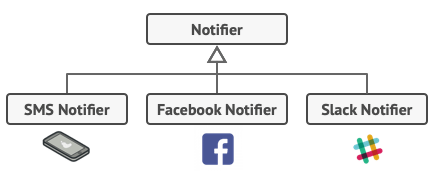
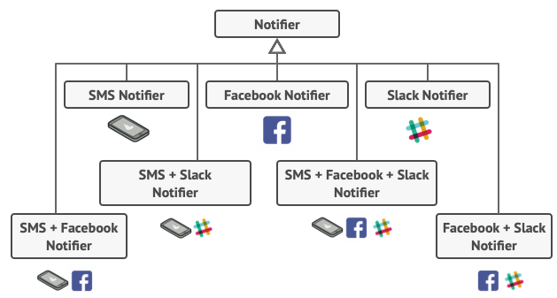
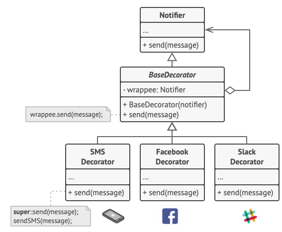

# Sorun :(

 

# Çözüm :)

<a href="https://refactoring.guru/design-patterns/decorator">
<b>Decorator Pattern-refactoringGuru</b>
</a>

 

<a href="https://www.udemy.com/course/designpatterns/">
<b>Decorator Pattern-Akın Kaldıroğlu</b>
</a>